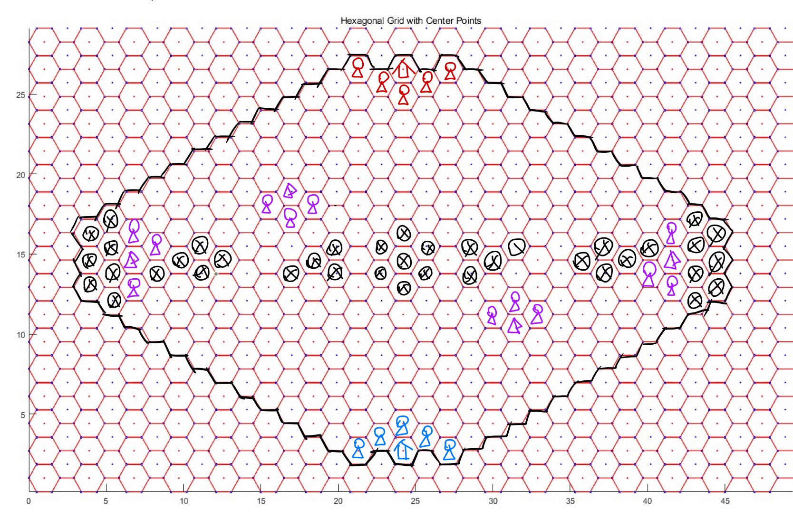
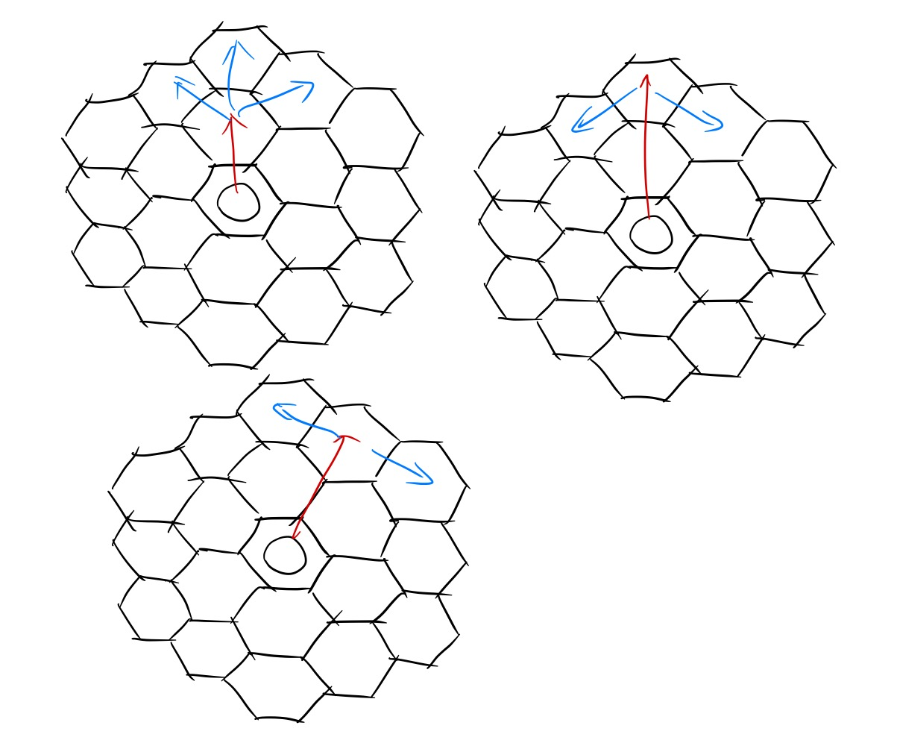
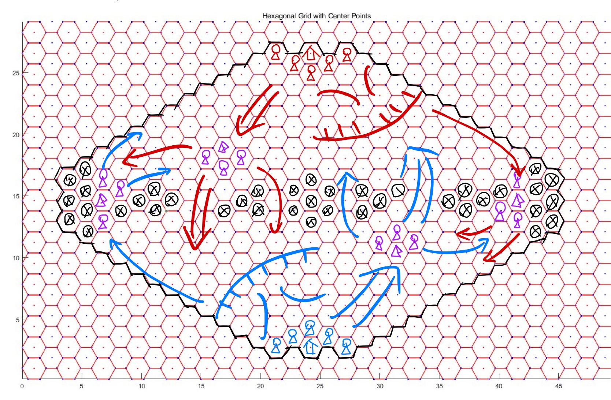

<h1 style="text-align: center">神迹之战 2.3beta</h1>
# 最新更新

见 [`update-log-2.3beta.pdf`](update-log-2.3beta.pdf)

# 游戏介绍

神迹之战是一款同时为人类玩家和AI设计的，基于六边形地图的战棋游戏。具有丰富的策略性与趣味性。

# 地图介绍



**要素** ：

- 地图中心对称，但不轴对称
- 双方 **神迹** （红色与蓝色的房屋标志）在地图两侧，拥有5个 **初始出兵点** （红色与蓝色的小人标志） 
- 地图上有4处 **驻扎点** （紫色帐篷标志），每个被 **占领** 的驻扎点提供 **3** 个 **额外出兵点** （紫色小人标志）
- 被黑色 $\otimes$ 标记的格子为 **深渊** ，深渊仅有 **飞行生物** 可以 **经过** 与 **停留**

## 神迹

双方 **神迹** 具有 *30* 生命上限，不会恢复

- 神迹不属于 *生物*
- 神迹生命值率先降至 **0** 及以下的一方落败

## 驻扎点

**驻扎点** 默认为中立。

每个回合开始，当一名 **非潜行** **地面生物** 位于一个 **驻扎点** 上方时，在本回合内，该 **驻扎点** 被 **该生物** 所属的一方占领。

在本回合内， **驻扎点** 的占领状态不会因为（用于占领的生物离开等）任何因素而改变。

被己方占领的 **驻扎点** 周围的 **出兵点** 视为 **己方出兵点** （**额外出兵点**） 。

## 出兵点

**初始出兵点** 和 **额外出兵点** 统称 **出兵点** 。

每回合都可以在 **己方出兵点** 召唤生物，如果某个召唤行为会导致 **生物重叠** ，则不能进行召唤。

- 一个 **己方出兵点** 上如果有一个 **地面生物** （无论敌我），则你不可以在此召唤 **地面生物** ，但你可以在此召唤 **飞行生物** 。反之亦然。

## 深渊

**深渊** 是一种特殊地形。

**地面生物** 无法 **经过** 或 **停留** 在 **深渊** 中 *~~（，如果 **地面单位** 被 **强制位移** 并停留至 **深渊** 则立即死亡（但穿过不会））【暂无强制位移机制】~~* 。

**飞行生物** 可以自由 **经过** 和 **停留** 在 **深渊** 中。


# 基本机制

## 游戏流程

### 确定先后手

随机确定先后手，并告知双方玩家

### 提交卡组

双方玩家提交自己的卡组，卡组包含 *1* 种 **神器** 和 *3* 种不同 **生物**

> 实际上由于不存在抽卡，可以理解为这些卡一开始就全在手牌里

不合法的卡组直接判负。

### 对局开始

公布双方卡组 。

进入 **先手玩家** 的回合，之后轮流进行回合。


## 法力值

游戏开始时， **先手玩家** 拥有 *1* **法力上限** ， **后手玩家** 拥有 *2* **法力上限**。

回合开始时：

1. 先手玩家的奇数回合，即总第 *4k+1* 回合， **法力上限** 增大 **1** ；后手玩家的偶数回合，即总第 *4k* 回合， **法力上限** 增大 **1** 
2. 当前玩家 **法力值** 设置为 **法力上限**

> 实际上，先手玩家的第一个回合也会增长法力上限，所以实际上双方玩家前几个回合的法力上限如下表：
>
> | 回合数   | 1    | 2    | 3    | 4    | 5    | 6    | 7    | 8    |
> | -------- | ---- | ---- | ---- | ---- | ---- | ---- | ---- | ---- |
> | 先后手   | 先   | 后   | 先   | 后   | 先   | 后   | 先   | 后   |
> | 法力上限 | 2    | 2    | 2    | 3    | 3    | 3    | 3    | 4    |
>
> 先手在自己的第21回合，总的第41回合到达12法力上限；后手在自己的第20回合，即总的第40回合到达12法力上限。

召唤生物、使用神器都会消耗法力值。

**法力上限** 最高为 **12****


## 冷却

### 生物

每种生物在加入卡组后会提供若干张 **生物单元** 。

> 生物单元的数量由生物种类决定，如：将剑士编入卡组将获得4张剑士生物单元，而将弓箭手编入卡组将获得3张弓箭手生物单元

每张 **生物单元** 可以被 *独立地* 消耗，用于一次任意 **星级** 的该种生物召唤。

召唤出的 **生物** **死亡** 后，召唤其所消耗的 **生物单元** 会进入 **冷却** ， 冷却结束后才能再次用于召唤。

冷却所需回合数与生物 **种类** 和 **星级** 有关。

### 神器

**神器-回收** 后进入冷却，冷却结束后可再次使用。

> **神器-回收** 的相关描述参见 **神器** 条目

**回收** 时机和 **冷却时间** 与神器有关。


## 玩家回合

双方玩家轮流进入 **回合** ，每个回合分为以下阶段：

### 回合开始

按顺序处理以下事件：

1. 当前玩家 **法力上限** 增大 **1** 
2. 当前玩家 **法力值** 设置为 **法力上限**
3. 当前玩家占领 **驻扎点**
4. 处理描述带有 **回合开始** 的卡牌效果

### 冷却阶段

己方 **生物单元** 和 **神器** **剩余冷却时间** 减少 1 。

**剩余冷却时间** 为 0 的 **生物单元** 和 **神器** 变为可用。

### 主要阶段

在该阶段，玩家可以任意进行以下操作：

- **召唤生物** 
- **生物-移动** 
- **生物-攻击** 
- **神器-使用** 

### 回合结束

处理描述带有 **回合结束** 的卡牌效果


## 胜利判定

满足如下条件时，游戏结束：

1. 一方AI回合超时
2. 一方神迹血量小于等于0
3. 双方完成的回合总数到达200

依次按照以下规则判定胜者：

1. 回合超时的AI判负，其对手获胜
2. 如果没有AI超时，神迹剩余血量更多的一方获胜
3. 如果神迹剩余血量相同，计算所有阵亡的己方生物的 **星级** 之和，阵亡己方生物星级和较小的一方获胜


# 生物

## 生物单元

每种生物在加入卡组后会提供若干张 **生物单元** 。

每张 **生物单元** 可以被 *独立地* 消耗，用于一次任意 **星级** 的该种生物召唤。

召唤出的 **生物** **死亡** 后，召唤其所消耗的 **生物单元** 会进入 **冷却** ， 冷却结束后才能再次用于召唤。

冷却所需回合数与生物 **种类** 和 **星级** 有关。

## 星级

**生物** 拥有 **3** 个 **星级** 不同的版本，不同 **星级** 的生物拥有相似的定位和特性，但往往具有不同的 **基本属性** 。

**生物单元** 可以用于任意 **星级** 的该种生物召唤。

## 基本属性

生物拥有6种 **基本属性** —— **法力消耗** 、 **攻击力** 、 **攻击距离** 、 **最大生命值** 、 **最大行动力** 、 **冷却时间** 。

### 法力消耗

生物 **召唤** 时会消耗等同于 **法力消耗** 的 **法力值** 。

### 攻击力

决定生物 **攻击** 和 **反击** 造成的 **伤害**

### 攻击距离

决定生物攻击的范围。在棋盘中，两个格子的 **直线距离** 定义为从一个格子走到另一个格子，无视地形和生物所需要的最少步数。而 **攻击距离X-Y** 意为该生物能攻击到与其所在格 **直线距离** 在 **X-Y** 范围内的格子上的生物。

**飞行生物** 的 **攻击范围** 包括 **空中层** 和 **地面层** ， **地面生物** 的 **攻击范围** 包含 **地面层** ， 如果有 **对空** 属性，则还包含 **空中层** 。

### 最大生命值

生物 **生命值** 的最大值， **生物-召唤** 后， **初始生命值** 等于 **最大生命值** 。

受到 **治疗** 后，生命值不会超过最大生命值。

### 最大行动力

**生物-移动** 时，一条 **合法移动路径** 的最大格数。

**地面生物** 计算 **合法路径** 时，不能 **经过** 或 **停留** 于 **其他地面生物** 、**神迹** 、 **深渊** ；不能 **经过** 但能 **停留 ** 于 **敌方飞行生物** 、 **敌方地面生物周围1格** 。

**飞行生物** 计算 **合法路径** 时，不能 **经过** 或 **停留** 于 **其他飞行生物** ；不能 **经过** 但能 **停留 ** 于 **敌方地面生物** 、 **敌方飞行生物周围1格** 。

**路径** 的格子不包含移动前的位置。

**停留** 的格子即路径的最后一格。

**经过** 的格子不包含最后停留的格子。

**另一种描述方式**：

每个生物 **占据** 某一格的某一层，这使得双方生物都不能经过/停留于该格该层。同时，每个生物 **拦截** 同层的周围6格和同格的另一层，这使得 **敌方生物** 不得经过这些区域，一旦走入就必须停止移动。

> 提示：间断（生物之间间隔1格）防线能很好地阻击敌方同层生物，同时减少需要用到的生物数量和增大攻击面积。但对于非同层生物仅能起到有限的拖延作用。

### 冷却时间

指 **生物-死亡** 后，对应 **生物单元** 重新可用前，需要经历的 **冷却阶段** 数。

## 相关操作

### 召唤

消耗 **法力值** 和 **对应生物单元** ，在指定位置，召唤一个指定 **种类** 和 **星级** 的生物。

如无特殊 **词条** ，生物 **召唤** 出来的当回合不能 **攻击** 或 **移动** 。

### 攻击

让一个处于 **可攻击状态** 的 **生物（攻击者）** 对攻击范围内 **敌方生物/神迹（被攻击者）** 发起一次攻击，造成等同于 **攻击者** **攻击力** 的伤害。

如果 **攻击者** 同时也在 **被攻击者** 的攻击范围内， **被攻击者** 会对 **攻击者** 进行 **反击** ，造成等同于 **被攻击者** **攻击力** 的伤害。

**攻击力** 为 0 的生物不可 **攻击**  。

如无特殊 **词条** ，一个生物在一个回合内不可以既 **移动** ，又 **攻击** 。

### 移动

让一个处于 **可移动状态** 的 **生物** 移动到指定地点。

移动时的 **占据** 与 **拦截** 的相关概念，参见 **最大行动力** 一条。

## 死亡

如果玩家的一次指令所引发的事件全部处理完毕后，进行一次 **死亡检索** ，如果存在场上生物 **生命值** 降至 0 或更低，则这样的生物会进入 **濒死状态** 。这些 **濒死** 生物会依次进入 **死亡结算** ——他们的 **亡语** 会被触发，接着模型被删除，召唤他们所用的 **生物单元** 会进入冷却。

生物一旦进入 **濒死状态** ，即使因为其他生物的 **亡语** ，生命恢复到 0 以上，也一样会进行 **死亡结算**。

当所有 **濒死** 生物 **死亡结算** 完成后，进行一轮新的 **死亡检索** ，直到不再有生物生命值为 0 或更低。

## 词条

### 长词条

#### 触发

达成某种条件时，触发某种效果

#### 光环

对一定范围内满足条件的生物产生持续效果

#### 亡语

死亡时生效的触发效果

### 短词条

#### 对空

仅 **地面生物** 可能有本词条

可攻击 **攻击范围** 内的 **地面生物** 和**飞行生物**

#### **飞行**

是 **飞行生物** ，可攻击 **攻击范围** 内的 **地面生物** 和**飞行生物**

#### 圣盾

抵消受到的第一次伤害，不可叠加


# 神器

## 基本属性

神器拥有基本属性： **法力消耗** 、 **冷却时间**  、 **使用方式** 。

### 法力消耗

**使用** 神器时需要消耗的 **法力值** 。

### 冷却时间

神器 **回收** 后直到变为 **可用** 所需经历的 **回合数**。

**回收** 时机由使用方式决定。

## 使用方式

神器有3种使用方式，每个神器的使用方式是固定的。

### 释放

可以理解为魔法卡，当即使用，产生效果，立即 **回收**

### 生成

当即使用，产生效果（可能没有即时效果）。

产生效果之后，会在目标地点生成一个 **神器生物** ，被看作 **生物**。

**神器生物** 死亡后， **神器** 才 **回收** 。

### 装备

以 **友方生物** 为目标使用，使用后为目标生物增加 **属性** 和 **词条** 

装备神器的生物死亡后， **神器回收**


# 卡牌一览

## 生物

费用/攻击/生命/最小范围-最大范围/行动力/冷却

> 攻击范围0表示不可攻击/反击，0-0表示可攻击与自身相同格子的生物（正上方/正下方）

### 剑士

- 生物单元数量：6

#### L1

- 2/2/2/1-1/3/2

#### L2

- 4/4/4/1-1/3/2

#### L3

- 6/6/6/1-1/3/3


### 弓箭手

- 生物单元数量： 3

#### L1

- 2/1/1/3-4/3/4
- **对空**

#### L2

- 4/2/2/3-4/3/4
- **对空**

#### L3

- 6/3/3/3-4/3/4
- **对空**


### 黑蝙蝠

- 生物单元数量：3

#### L1

- 2/1/1/0-1/4/3
- **飞行**

#### L2

- 3/2/1/0-1/4/3
- **飞行**

#### L3

- 5/4/2/0-1/5/4
- **飞行**


### 牧师

- 生物单元数量：3

### L1

- 2/0/3/0/5/4
- 触发 ： **己方回合结束** 时，(范围2) **友方生物** 回复 1 生命
- 光环 ： (范围2) 友方生物 +1 攻击力  

### L2

- 4/0/4/0/5/4
- 触发 ： **己方回合结束** 时，(范围3) **友方生物** 回复 1 生命
- 光环 ： (范围3) **友方生物** +1 攻击力  

### L3

- 7/0/5/0/5/5
- 触发 ： **己方回合结束** 时，(范围4) **友方生物** 回复 2 生命
- 光环 ： (范围4) **友方生物** +1 攻击力  

> 回复生命效果对自身起作用，加攻击力效果对自身不起作用
>
> 如果范围内有其他牧师，加攻击力会对其他牧师起作用，但牧师依然无法攻击和反击


### 火山之龙

- 生物单元数量： 3

#### L1

- 5/3/5/1-2/2/5
- **触发** ：**攻击** **敌方地面生物** 后，对 （与目标距离1） 且 （与自身距离2） 的 **敌方地面生物** 造成 3 点伤害

#### L2

- 7/4/7/1-2/2/5
- **触发** ：**攻击** **敌方地面生物** 后，对 （与目标距离1） 且 （与自身距离2） 的 **敌方地面生物** 造成 4 点伤害

#### L3

- 9/5/9/1-2/2/5
- **触发** ：**攻击** **敌方地面生物** 后，对 （与目标距离1） 且 （与自身距离2） 的 **敌方地面生物** 造成 5 点伤害

> 相当于锥形攻击（攻击距离2目标不会溅射距离1目标），溅射伤害不享受攻击力加成
>
> 如下图，红色箭头为选取的目标，蓝色箭头为溅射到的位置
>
> 选择距离为2的目标时，距离为1的生物并不会被溅射




## 冰霜之龙

- 生物单元数量： 3

#### L1

- 5/3/4/0-2/2/4
- **对空**

#### L2

- 7/4/6/0-2/2/4
- **对空**

#### L3

- 9/5/8/0-2/2/5
- **对空**


## 神器

法力值/冷却

### 塞瓦哈拉的圣光之耀

- 6/5
- **释放**：任意位置（包括 **深渊** ）
- 回复 (**目标地点** 范围2) **友方生物** 生命值至生命上限，(**目标地点** 范围2) 友方生物 **直到下下个回合开始** 获得 +2 攻击。


### 洛古萨斯的地狱之火

- 8/6
- **生成** ： (神迹范围7 或 占领驻扎点范围5) 且 无地面生物 且 非深渊 的位置
- **召唤物** ：
  -  8/12/0-1/3
  - **对空**
- 使用时对 (目标范围2) 内 **敌方生物** 造成 2 伤害，然后 **生成** 一个 **召唤物**


### 马尔瑞恩的阳炎之盾

- 6/4
- **装备**：友方生物
- +0/+3
- **圣盾**（抵消受到的第一次伤害，不可叠加）
- **触发** ： **己方回合开始** 时，获得 **圣盾**


# 手把手教你写AI

## 第一个“AI”

AI模板文件为 `ai.cpp` 和 `ai.py` ，内含一个继承自 `AiClient` 的类 `Ai` ，定义有成员函数 `play()` 。

在主程序中，会周期性地调用成员函数 `Ai.play()` 。

你所需要做的就是在 `play()` 函数中填充代码。

我们先来了解一个”AI“应当至少具备的三种操作。

### 召唤生物

游戏的目标在于摧毁对手的神迹，而对神迹造成伤害的主力军自然是各式各样的生物。

那么我们来看看召唤生物对应的SDK

**C++**

```c++
// 在[x,y,z]位置处召唤一个本方类型为type,星级为level的生物
void summon(std::string type, int level, int x, int y, int z);

// 在position位置处召唤一个本方类型为type,星级为level的生物
void summon(std::string type, int level, std::vector<int> position);

// 在position位置处召唤一个本方类型为type,星级为level的生物
void summon(std::string type, int level, std::tuple<int, int, int> position);
```

事实上 `std::tuple<int, int, int>` 已经被 `typedef` 为 `gameunit::Pos` ，SDK中各种位置信息也都用 `gameunit::Pos` 来储存。因此我们最常用第三种召唤函数来进行召唤。

**Python**

```python
def summon(self, _type: str, level: int, position: tuple):
    """
    在位置position处召唤一个本方类型为_type,星级为level的生物
    """
    pass
```

一个最简单的”AI“只需要不断尽可能地在指定位置召唤指定生物即可。

---

召唤生物需要剩余法力值充足，我们可以用以下代码获知当前回合的法力上限和当前的剩余法力值。

**C++**

```c++
int max_mana = players[my_camp].max_mana; //当回合法力值上限
int mana = players[my_camp].mana; //当前剩余法力值
```

**Python**

```python
max_mana = self.players[self.my_camp].max_mana # 当回合法力值上限
mana = self.players[self.my_camp].mana # 当前剩余法力值
```

---

你希望知道一个生物的信息，以便帮助你判断能否召唤这一生物，你需要用到 `card.h` / `card.py` 中的内容。

**C++**

```c++
const std::map<std::string, const Creature *> CARD_DICT = {
        std::map<std::string, const Creature *>::value_type("Swordsman", SWORDSMAN),
        std::map<std::string, const Creature *>::value_type("Archer", ARCHER),
        std::map<std::string, const Creature *>::value_type("BlackBat", BLACKBAT),
        std::map<std::string, const Creature *>::value_type("Priest", PRIEST),
        std::map<std::string, const Creature *>::value_type("VolcanoDragon", VOLCANOGRAGON)
};
```

在 `namespace card` 内有一个 `std::map<std::string, const Creature *>` 类型常量 `CARD_DICT` ，你可以用过 `CARD_DICT.at(creature_type_name)[star]` 得到一个 `card::Creature` 类型的常量。其记录了该种类该星级的生物的基本模板信息。

```c++
struct Creature // 生物
{
    std::string type;    // 种类
    int available_count; // 生物槽容量
    int cost;            // 法力消耗
    int atk;             // 攻击
    int max_hp;          // 最大生命值
    int min_atk_range;   // 最小攻击范围
    int max_atk_range;   // 最大攻击范围
    int max_move;        // 行动力
    int cool_down;       // 冷却时间
    bool flying;         // 是否飞行
    bool atk_flying;     // 能否对空
    bool agility;        // 是否迅捷
    bool holy_shield;    // 有无圣盾
}
```

例如，你可以通过 `card::CARD_DICT.at("VolcanoDragon")[1].cost` 来获取1星火山之龙的法力消耗。

**Python**

```python
CARD_DICT = {
    'Swordsman': SWORDSMAN,
    'Archer': ARCHER,
    'BlackBat': BLACKBAT,
    'Priest': PRIEST,
    'VolcanoDragon': VOLCANOGRAGON
}
```

在 `card.py` 内有一个字典 `CARD_DICT` ，你可以用过 `CARD_DICT[creature_type_name][star]` 得到一个 `card.Creature` 类型的常量。其记录了该种类该星级的生物的基本模板信息。

```python
class Creature:
    """
    生物
    """    
    def __init__(self, _type, _count, _cost, _atk, _maxhp, _minatk, _maxatk,
                 _maxmove, _cool, _fly, _atkfly, _agility, _holyshield):
        self.type = _type  # 种类
        self.available_count = _count  # 生物槽容量
        self.cost = _cost  # 法力消耗
        self.atk = _atk  # 攻击
        self.max_hp = _maxhp  # 最大生命值
        self.min_atk_range = _minatk  # 最小攻击范围
        self.max_atk_range = _maxatk  # 最大攻击范围
        self.max_move = _maxmove  # 行动力
        self.cool_down = _cool  # 冷却时间
        self.flying = _fly  # 是否飞行
        self.atk_flying = _atkfly  # 能否对空
        self.agility = _agility  # 是否迅捷
        self.holy_shield = _holyshield  # 有无圣盾
```

例如，你可以通过 `card.CARD_DICT['VolcanoDragon'][1].cost` 来获取1星火山之龙的法力消耗。

---

在召唤前，你需要确保在你需要召唤的 **位置和层**（指地面/空中） 没有其他生物。

你可以用继承自 `AiClient` 的 `getUnitByPos` / `get_units_by_pos`

**C++**

```c++
// 获取位置pos上的生物，flying表示是否为空中生物
// 如果有,返回对应的Unit,否则返回一个id为-1的Unit
gameunit::Unit getUnitByPos(gameunit::Pos pos, bool flying);
```

你可以用 `getUnitByPos(pos, false).id == -1` 表示 `pos` 的地面层没有生物

**Python**

```python
def get_unit_by_pos(self, pos: tuple, flying: bool) -> gameunit.Unit:
    """
    获取位置pos上的生物，flying表示是否为空中生物
    未找到时，返回None
    """
    pass
```

你可以用 `get_unit_by_pos(pos, False) is None` 表示 `pos` 的地面层没有生物

---

你想知道有哪些出兵点在本回合属于你，你可以使用继承自 `AiClient` 的 `getSummonPosByCamp` / `get_summon_pos_by_camp` 函数来获取本回合隶属于你的出兵点列表。

**C++**

```c++
// 获取所有属于阵营camp的出兵点(初始出兵点+额外出兵点)
std::vector<gameunit::Pos> getSummonPosByCamp(int camp);
```

**Python**

```python
def get_summon_pos_by_camp(self, camp: int) -> list:
    """
    获取地图上所有属于阵营camp的出兵点(初始出兵点+额外出兵点)
    """
    pass
```

得到的是 `list of gameunit.pos`


### 移动生物

刚召唤出来的生物经过一个回合的等待之后就可以移动了。不过我们的生物可不能飞跃半个地图打到对方的神迹，因此，我们需要控制生物移动到对方神迹附近。

让我们来看看移动生物对应的SDK

**C++**

```c++
// 将id为mover的生物移动到(x,y,z)位置处
void move(int mover, int x, int y, int z);

// 将id为mover的生物移动到position位置处
void move(int mover, std::vector<int> position);

// 将id为mover的生物移动到position位置处
void move(int mover, std::tuple<int, int, int> position);
```

同样，第三个版本最为常用。

**Python**

```python
def move(self, mover: int, position: tuple):
    """
    将id为mover的生物移动到位置position处
    """
    pass
```

不过，对于移动操作而言，光知道移动函数是不够的，你还需要一些其他函数的帮助。

---

你可能有很多生物需要移动。你可以用继承自 `AiClient` 的 `getUnitsByCamp` \ `get_units_by_camp` 函数来获取某一方所有的生物列表。

**C++**

```C++
auto ally_list = getUnitsByCamp(my_camp);
```

**Python**

```python
ally_list = self.get_units_by_camp(self.my_camp)
```

返回值是 `std::vector<gameunit::Unit>` / `list of gameunit.Unit`  。可以查阅相关文件获取 `Unit` 类型的更多信息。

---

`ally` 是 `ally_list` 中的一个元素，代表你的一个生物。

你想知道 `ally` 能否移动。

布尔值 `ally.can_move` 就储存了这一信息。为真则表示可以移动。

---

你可能想知道一个生物能移动到哪些格子，你可以用 `reachable` 函数（在 `calculator.h` 的 `namespace calculator` 和 `calculator.py` 中）。 

**C++**

```C++
auto reach_pos_with_dis = calculator::reachable(ally, map);
```

**Python**

```python
reach_pos_with_dis = calculator.reachable(ally, self.map)
```

**特别注意**的是，返回值为 `std::vector<std::vector<gameunit::Pos> >`  / `list of list of gameunit.Unit`

`reach_pos_with_dis[i]` 储存的是 `ally` 单位以最短路（考虑占据和拦截）走 `i` 步能到的位置的列表。

>  `reach_pos_with_dis[0]` 自然就是只含自身所在位置的一个元素的列表。

如果你不需要知道你走几步能到哪一格，你可以通过如下代码将这个列表的列表压平：

**C++**

```C++
vector<Pos> reach_pos_list;
for (const auto &reach_pos : reach_pos_with_dis) {
    for (auto pos : reach_pos)
        reach_pos_list.push_back(pos);
}
```

**Python**

```python
reach_pos_list = []
for reach_pos in reach_pos_with_dis:
    reach_pos_list += reach_pos
```

---

你想走到距离敌方神迹最近的位置，那么你首先需要知道敌方神迹的位置。

这里的 `map` 是继承自 `AiClient` 的成员变量，类型为 `gameunit::Map` / `gameunit.Map` 。

**C++**

```c++
gameunit::Pos enemy_pos = map.miracles[my_camp ^ 1].pos;
```

**Python**

```python
self.enemy_pos = self.map.miracles[self.my_camp ^ 1].pos
```

接着你可以通过 `calculator` 中的 `cube_distance` 来计算两个位置之间的距离。

**C++**

```c++
int cube_distance(Pos a, Pos b);
```

**Python**

```python
def cube_distance(a:tuple, b:tuple):
	pass
```

即计算 `pos` 到 `enemy_pos` 的距离可以用 `cube_distance(pos, enemy_pos)`

你可以依据这个距离作为关键字对 `reach_pos_list` 排序，从而走到距离敌方神迹最近的位置。


### 攻击目标

要取得胜利，你需要对敌方神迹造成足够的伤害，你会用到攻击命令。

让我们来看看命令生物攻击对应的SDK

**C++**

```c++
// 令id为attacker的生物攻击id为target的生物或神迹
void attack(int attacker_id, int target_id);
```

**Python**

```python
def attack(self, attacker_id: int, target_id: int):
    """
    令id为attacker的生物攻击id为target的生物或神迹
    """
    pass
```

攻击者 `attacker` 向目标`target` 发起一次合法的攻击需要满足2个条件——

1. `attacker.can_atk` 为真
2. `attacker` 与 `target` 的 **曼哈顿距离** 介乎 `attacker` 最小攻击范围和最大攻击范围之间。

#### 攻击神迹

攻击神迹时，需要保证神迹在攻击者的攻击范围内。

假设你正操纵的生物为 `ally` ，是一个 `gameunit::Unit` / `gameunit.Unit` 类型的变量。

那么 `ally.atk_range[0]` 为其最小攻击距离，  `ally.atk_range[1]` 为其最大攻击距离。只有 **曼哈顿距离** 介乎这二者之间的神迹和生物才有可能被攻击到。

利用 **移动生物** 一节中介绍的 ·`cube_distance` 函数，计算 `ally` 到敌方神迹的距离 `dis = cube_distance(ally.pos, enemy_pos)`

因此，只需判断， `ally.atk_range[0] <= dis && dis <= ally.atk_range[1]` 是否为真，即可得知 `ally` 能否攻击神迹。

而特别的，神迹的id与阵营编号相同，己方神迹id为 `my_camp` ，敌方神迹id为 `my_camp ^ 1` 

>  `^` 为异或符号，相同的两个1位二进制数异或和为0，不同为1—— `my_camp ^ 1` 表示 “ `my_camp == 0` 则得 `1` ， `my_camp == 1` 则得 `0` ”

那么，你可以使用 `attack(ally.id, my_camp ^ 1)` 来下达攻击对方神迹的命令。

#### 攻击生物

在前往敌方神迹的路途中，你会遭遇敌方生物，虽然你可以忽略他们勇往直前，但这并不是一个聪明的套路。

你需要与敌方生物战斗，你需要命令你的生物 `ally` 攻击敌方生物。

要攻击敌方生物，你得先知道敌方生物有哪些，用 **移动生物** 一节中介绍的 `getUnitsByCamp` / `get_units_by_camp` 来获取敌方生物列表。

**C++**

```c++
auto enemy_list = getUnitsByCamp(my_camp ^ 1);
```

**Python**

```python
enemy_list = self.get_units_by_camp(self.my_camp ^ 1)
```

接下来，你想判断 `ally` 能攻击到哪些敌方生物，继承自 `AiClient` 的函数 `canAttack` / `can_attack` 实现了这一功能。用如下代码可将 `ally` 能攻击到的生物加入列表 `target_list` 中：

**C++**

```c++
vector<Unit> target_list;
for (const auto &enemy : enemy_list)
    if (AiClient::canAttack(ally, enemy))
        target_list.push_back(enemy);
```

**Python**

```python
target_list = []
for enemy in enemy_list:
    if self.can_attack(ally, enemy):
        target_list.append(enemy)
```

接下来就只要从 `target_list` 中选择一个 `target` 然后调用 `attack` 指令即可：

**C++**

```c++
attack(ally.id, target.id);
```

**Python**

```python
self.attack(ally.id, target.id)
```


### 结束回合

使用继承自 `AiClient` 的 `endRound()` / `end_round()` 函数结束回合。

结束回合后，你的程序将被挂起，在下一次调用 `play()` 前，请避免进行任何操作和运算。

你可以调用`updateGameInfo()` / `update_game_info()` 获取新的局面信息。在正常情况下，这个函数会在每一次操作后自动被调用，不需要手动调用。特别注意，**此函数会进行一定量的数据收发，请尽可能避免过于频繁额外调用，以免导致你的AI程序超时而被判负**。

### 几个注意事项

1. 提交任何操作之后，之前获取的信息可能发生改变，需要重新获取一次，例如召唤后友方生物列表会变化，移动后地图信息会变化，攻击后友方生物和敌方生物列表都会发生变化。
2. 请记得在 `play()` 函数的最后调用回合结束指令。


## 更高级的“AI”

我们已经学会了生物的召唤、移动和攻击，但是游戏的关键机制—— **驻扎点** 和 **神器** 还没有用上。

这里只给出这两部分的SDK，希望选手通过阅读SDK的代码进一步发现他们的用法。

### 驻扎点

#### `gameunit.h`

```c++
struct Barrack // 驻扎点
{
    Pos pos;                          // 位置
    int camp;                         // 阵营
    std::vector<Pos> summon_pos_list; // 出兵点位置
    Barrack(int _camp, Pos _pos, std::vector<Pos> _list) : pos(_pos), camp(_camp), summon_pos_list(_list) {}
};

struct Map // 地图
{
    std::vector<Unit> units;
    std::vector<Barrack> barracks;
    std::vector<Miracle> miracles;
    std::vector<Obstacle> obstacles;
    std::vector<Obstacle> flying_obstacles;
    std::vector<Obstacle> ground_obstacles;
};
```

#### `ai_client.h`

```c++
// 对于pos位置,判断其驻扎情况
// 不是驻扎点返回-2,中立返回-1,否则返回占领该驻扎点的阵营(0或1)
int checkBarrack(gameunit::Pos pos);
```

---

#### `gameunit.py`

```python
class Barrack:
    """
    驻扎点
    """
    def __init__(self, pos=(0,0,0), summon_pos_list=None, camp=-1):
        if summon_pos_list is None:
            summon_pos_list=[]
        self.pos = tuple(pos)  # 位置
        self.camp = camp  # 阵营
        self.summon_pos_list = summon_pos_list  # 出兵点位置
        
        
class Map:
    """
    地图
    """
    def __init__(self):
        self.units = ...
        self.barracks = ...
        self.miracles = ...                         
        ABYSS_POS_LIST = ...
        self.obstacles = ...
        self.flying_obstacles = []
        self.ground_obstacles = self.obstacles[:]
```

#### `ai_client.py`

```python
def check_barrack(self, pos: tuple) -> int:
    '''判定位置pos的驻扎情况
    Args:
        pos: 地图上的(x,y,z)位置
    Returns:
        int 不是驻扎点返回-2,中立返回-1,否则返回占领该驻扎点的阵营(0或1)
    '''
    pass
```

### 神器

#### `gameunit.h`

```c++
struct Artifact // 神器
{
    int id;                  // id
    std::string name;        // 名字
    int camp;                // 阵营
    int cost;                // 法力消耗
    int max_cool_down;       // 最大冷却时间
    int cool_down_time;      // 当前冷却时间
    std::string state;       // 使用状态
    std::string target_type; // 目标种类
};
```

#### `ai_client.h`

```c++
// 对id为target的生物使用artifact神器
void use(int artifact, int target);

// 对target位置使用artifact神器
void use(int artifact, std::vector<int> target);

// 对target位置使用artifact神器
void use(int artifact, std::tuple<int, int, int> target);

// 判断能否对pos位置使用artifact神器(不考虑消耗、冷却)
bool canUseArtifact(gameunit::Artifact artifact, gameunit::Pos pos, int camp);

// 判断能否对unit生物使用artifact神器(不考虑消耗、冷却)
bool canUseArtifact(gameunit::Artifact artifact, gameunit::Unit unit);
```

#### `card.h`

```c++
struct Artifact // 神器
{
    std::string name;        // 名字
    int cost;                // 法力消耗
    int cool_down;           // 冷却时间
    std::string target_type; // 目标类型
    Artifact(std::string _name, int _cost, int _cool, std::string _targettype)
            : name(_name), cost(_cost), cool_down(_cool), target_type(_targettype) {}
};

// 圣光之耀
const Artifact HOLYLIGHT = Artifact("HolyLight", 8, 6, "Pos");

// 阳炎之盾
const Artifact SALAMANDERSHIELD = Artifact("SalamanderShield", 6, 4, "Unit");

// 地狱之火
const Artifact INFERNOFLAME = Artifact("InfernoFlame", 6, 6, "Pos");
```

---

#### `gameunit.py`

```python
class Artifact:
    '''神器
    '''

    def __init__(self, artifact_list=None):
        if artifact_list is None:
            artifact_list = [-1, 0, 0, 0, 0, 0, 0]
        self.camp = artifact_list[0]
        self.name = artifact_list[1]
        self.id = self.camp
        self.cost = artifact_list[2]
        self.max_cool_down = artifact_list[3]
        self.cool_down_time = artifact_list[4]
        self.state = artifact_list[5]
        self.target_type = artifact_list[6]
```

#### `ai_client.py`

```python
def use(self, artifact: int, target):
    """
    对目标target使用artifact神器
    Args:
        artifact: 使用的神器的id
        target: 目标生物的id / 地图的[x,y,z]位置
    """
    pass

def can_use_artifact(self, artifact: gameunit.Artifact, target, camp: int) -> bool:
    '''
    判断阵营camp能否对目标target使用神器artifact(不考虑消耗、冷却)
    Args:
        artifact: 神器
        target: 目标(Unit或者Pos)
        camp: 使用神器的阵营
    Returns:
        bool 能攻击到返回True,不能攻击到返回False
    '''
    pass
```

#### ` card.py`

```python
class Artifact:
    """
    神器
    """    
    def __init__(self, _name, _cost, _cool, _targettype):
        self.name = _name  # 名字
        self.cost = _cost  # 法力消耗
        self.cool_down = _cool  # 冷却时间
        self.target_type = _targettype  # 目标类型

        
HOLYLIGHT = Artifact("HolyLight", 8, 6, "Pos") # 圣光之耀

SALAMANDERSHIELD = Artifact("SalamanderShield", 6, 4, "Unit") # 阳炎之盾

INFERNOFLAME = Artifact("InfernoFlame", 6, 6, "Pos") # 地狱之火
```

### 一些可能有用的小策略

不做解释

1. 卡射程
2. 利用拦截机制形成间隔防线
3. 互相保护
4. 抱团，或吸引抱团，利用神器


## 更智能的AI

以上教学部分已经结束了，但可以发现以上内容仅仅是简单的逻辑分支，还远远称不上智能。

让AI智能起来可以从以下方面考虑。

1. 引入局面评估方法，既可以对单次操作的目标进行评估以选择最大价值的目标，也可以对整体局面进行评估已决定行动顺序
2. 引入对抗搜索，预测对手的行动以提前准备对策，使得局面偏向有利于自己的一面

### 作战策略示例

对下图不作任何解释

